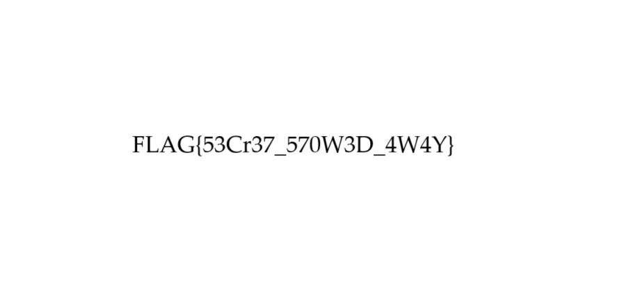

# 🏆 CTF Challenge Write-up: Phantom Format 

## 📌 Challenge Description  
A seemingly standard image file hides an unexpected secret. Its true nature can only be revealed by carefully inspecting its internal structure. Can you discover the concealed content?

Challenge files: 

Flag Format: FLAG{SAMPLE_FLAG}

## 🔍 Approach  

1️⃣ **Metadata Analysis** (ExifTool) – No hidden metadata found.  
2️⃣ **Forensic Analysis** (FotoForensics) – No anomalies detected.  
3️⃣ **Hidden Data Detection** (Running the command: `binwalk mystery.png`) – Found a hidden ZIP archive inside the image.  
4️⃣ **Extraction** (`binwalk -e mystery.png`) – Extracted **flag.png** from the archive.  
5️⃣ **Flag Retrieval** – The flag was inside **flag.png**.  



## 🛠 Tools Used  
- **ExifTool** (Online) – Metadata analysis  
- **FotoForensics**(online) – Image forensics  
- **WSL + Binwalk** – Hidden file extraction  

## 🎯 Key Takeaways  
✅ Always inspect files for **hidden metadata & embedded data**.  
✅ **Binwalk** is useful for detecting **hidden archives inside images**.  
✅ Some challenges require **multiple forensic techniques**.  

## 🏁 Final Flag  
```

FLAG{53Cr37_570W3D_4W4Y}

```


