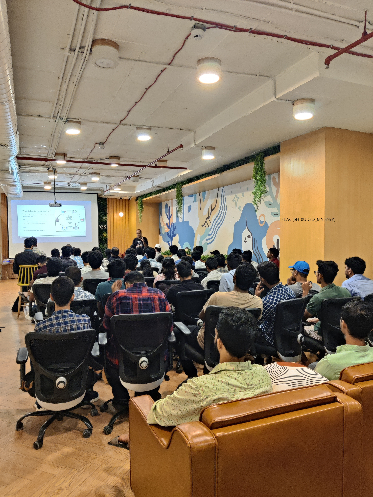

# 🏆 CTF Challenge Write-up: Mystic Veil  

## 📌 Challenge Description  
A seemingly ordinary file conceals a hidden secret beneath a cryptic transformation. The process is subtle, with little to go on. Your task is to break through the veil and uncover what lies beneath. Good luck!

Challenge files: [Encryption Script](Tasks/MysticVeil/Encrypt.py)

Challenge files: 

Flag Format: FLAG{SAMPLE_FLAG}

## 🔍 Approach  

### **🧩 1. Initial Analysis**  
- The challenge provided **an encrypted image** and **a Python encryption script**.  
- The encryption resembled **a simplified AES** with:  
  - **S-Box Substitution**  
  - **ShiftRows Operation**  
  - **Add Round Key**  

### **🔑 2. Decryption Process**  
Using the given encryption logic, the decryption involved:  
✅ **Inverse S-Box Transformation** (to reverse SubBytes)  
✅ **Inverse ShiftRows** (to restore original byte positions)  
✅ **Applying Round Keys in Reverse**  
✅ **Removing PKCS Padding**  

### **⚙️ 3. Execution & Results**  
Decryption was performed and the logic was in  [Decryption Script](Tasks/MysticVeil/Decrypt.py).

📌 **Decryption successful!** The **image was restored**, revealing **hidden data**.  

### **🚀 4. Flag Extraction**  
 
 
By analyzing `image_decrypted.jpg`  the hidden flag was extracted.  


## **🛠 Tools Used**  
- **Visual Studio Code** – for writing and executing the decryption script
- **Python** – for decryption

## **🎯 Key Takeaways**  
✅ Understanding **block ciphers** and **cryptographic reversal** is crucial in CTF 
challenges.  
✅ **Steganographic techniques** help uncover hidden data in images.  
✅ **Automating decryption** with Python speeds up forensic analysis.  

## 🏁**Final Flag:**  
```
FLAG{5Hr0UD3D_MY573rY}

```

---


