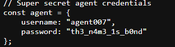
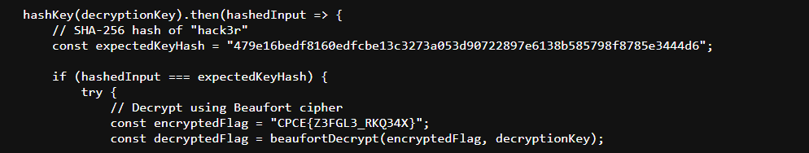

# 🏆 CTF Challenge Write-up: Phantom Format 

## 📌 Challenge Description  

A curious login interface conceals a hidden message. Solve the puzzle to reveal its secret.  

- **Target Link:** *https://threatactor001.github.io/Phantom-Login/*
   
- **Flag Format:** `FLAG{SAMPLE_FLAG}`  

## 🧩 Challenge Approach  

### 🔎 Initial Observations  
- A login page was displayed with no provided credentials.  
- Source code and JavaScript analysis revealed encoded data.  

### 🚀 Steps Taken  
1. **Source Code Inspection:** Found a comment hinting at **hex patterns in JavaScript**.  
2. **JavaScript Analysis:** Decoded Base64 and SHA-256 hash to retrieve `"hack3r"`.This matched the SHA-256 hash of 'hack3r' (also found in the script). 
3. **Logging In:** Used extracted credentials (`agent007` / `th3_n4m3_1s_b0nd`).

    
   
- Successfully logged in, revealing an encrypted flag: CPCE{Z3FGL3_RKQ34X}.
4. **Decryption:** Identified the encryption method as Beaufort cipher (from the JavaScript object in the page source).
  
   
- Applied **Beaufort Cipher** decryption to extract the **final flag**.
 and Used hack3r (derived from the SHA-256 hash) as the decryption key.


## 🛠 Tools Used  
- **DCode.fr**- Base64 decoding, hash matching, and Beaufort decryption.
  
## 🎯 Key Takeaways  

✅ Always inspect **source code and JavaScript** for hints.

✅ Recognizing **Base64 encoding and hashing algorithms** can help in CTFs.

✅ Understanding the **Beaufort cipher** and its decryption process.

## 🏁 Final Flag  
```

FLAG{S3CUR3_THR34D}

``` 

 

